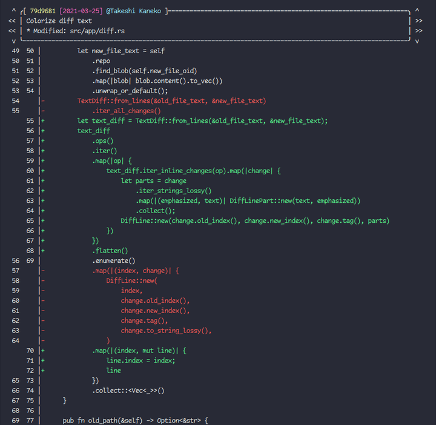

# git-hist

[](https://github.com/arkark/git-hist/actions)
[](https://crates.io/crates/git-hist)
[](https://github.com/arkark/git-hist/blob/master/LICENSE)

A CLI tool to quickly browse the git history of files **on a terminal**. This project is inspired by [git-history](https://github.com/pomber/git-history).

<div align="center">
    
</div>

## Installation

```sh
cargo install git-hist
```

## Usage

```sh
git hist <file>
```

You can use `git-hist` as a git subcommand, so the hyphen is not required.

### Commands

- `Left`/`Right`: Go to a previous/next commit.
- `Up`/`Down` or mouse scrolls: Scroll up/down.
- `PageUp`/`PageDown`: Scroll page up/down.
- `Home`/`End`: Scroll to the top/bottom.
- `q`/`Ctrl+c`/`Ctrl+d`: Exit.

### Help

```sh
$ git-hist --help
git-hist {{ version }}
A CLI tool to quickly browse the git history of files on a terminal

USAGE:
    git-hist [FLAGS] [OPTIONS] <file>

ARGS:
    <file>    Set a target file path

FLAGS:
        --beyond-last-line    Set whether the view will scroll beyond the last line
        --emphasize-diff      Set whether the view will emphasize different parts
        --full-hash           Show full commit hashes instead of abbreviated commit hashes
    -h, --help                Print help information
    -v, --version             Print version information

OPTIONS:
        --date-format <format>    Set date format: ref. https://docs.rs/chrono/0.4.19/chrono/format/strftime/index.html [default: [%Y-%m-%d]]
        --date-of <user>          Use whether authors or committers for dates [default: author] [possible values: author, committer]
        --name-of <user>          Use whether authors or committers for names [default: author] [possible values: author, committer]
```
